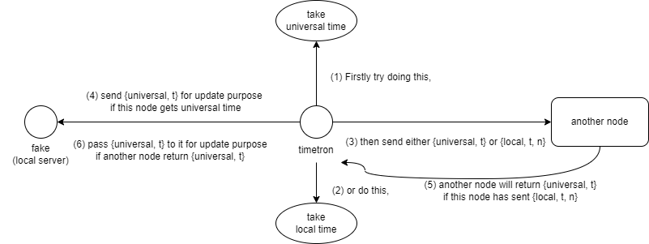

# timetron in Erlang

## Usage

```
$ cd src && erl
1> {c(timetron), c(ntp), c(courier)}.
{ok,timetron}
2> timetron:utc_time().
{{2024,5,15},{8,3,47}}
3> timetron:net().
{"pool.ntp.org",
 [{114,35,131,27},
  {125,229,162,223},
  {17,253,116,253},
  {103,147,22,149}]}
4> net:get_time().
{{li,0},
 {vn,4},
 {mode,4},
 {stratum,2},
 {poll,3},
 {precision,-23},
 {rootDelay,844},
 {rootDispersion,1590},
 {referenceId,216,239,35,8},
 {referenceTimestamp,1715768468.0777907},
 {originateTimestamp,-2208988800},
 {receiveTimestamp,1715768827.1037784},
 {transmitTimestamp,1715768827.3995132},
 {clientReceiveTimestamp,1715768976.38},
 {offset,-148.980486869812}}
5> % when the host is disconnected from network
   ntp:get_time().
{error,{badmatch,{error,nxdomain}},
      [{ntp,ntp_servers,0,[{file,"ntp.erl"},{line,10}]},
       {ntp,get_time,0,[{file,"ntp.erl"},{line,18}]},
       {erl_eval,do_apply,7,[{file,"erl_eval.erl"},{line,748}]},
       {shell,exprs,7,[{file,"shell.erl"},{line,691}]},
       {shell,eval_exprs,7,[{file,"shell.erl"},{line,647}]},
       {shell,eval_loop,3,[{file,"shell.erl"},{line,632}]}]}
6> {ok,S} = gen_server:start(courier, [{timetron_config,5000}], []).
{ok,<0,780,0>}
%% . . . 接下來每隔 5 秒會發出並收到時間訊息
6> {universal,{{2024,5,16},{12,16,14}}} received
6> {universal,{{2024,5,16},{12,16,19}}} received
6> {universal,{{2024,5,16},{12,16,44}}} received
6> gen_server:stop(S), f(S).
ok
%% . . . 此時 5 秒計時器停止
7> {ok,C} = courier:get_courier(3000),
   timer:apply_after(10000, gen_server, stop, [C]).
{ok,<0.152.0>}
8> {universal,1715952043.228} received
8> {universal,1715951858.753} received
8> {universal,1715952046.401} received
8> f(C).
ok
9> halt().
$
```

## 流程


